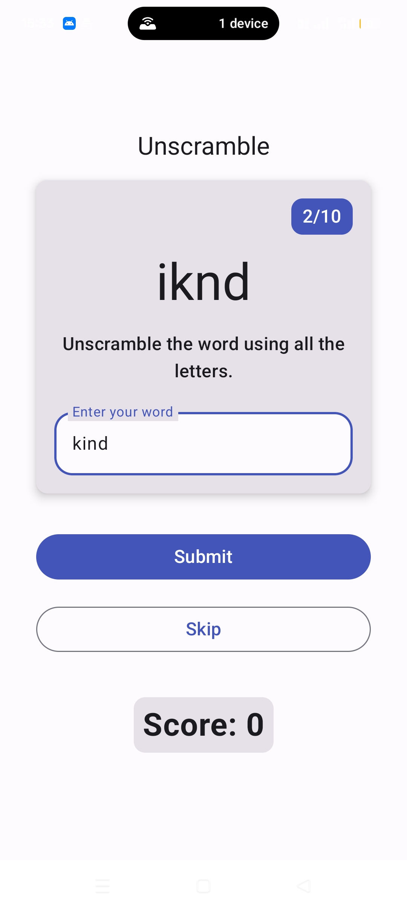
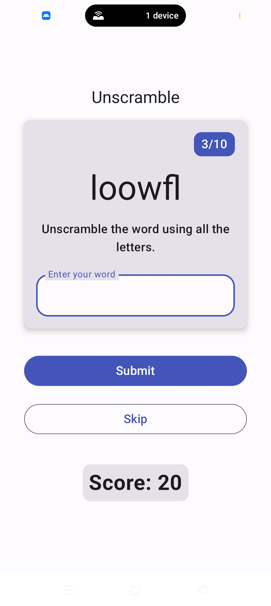
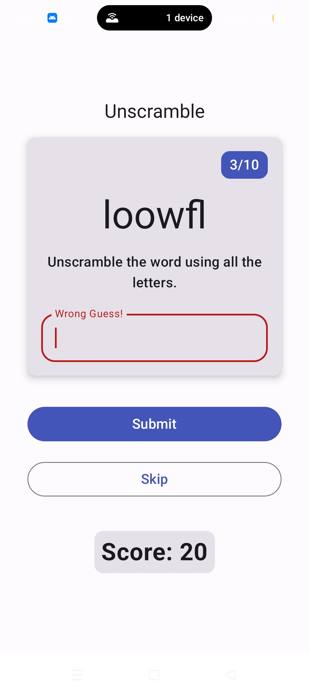
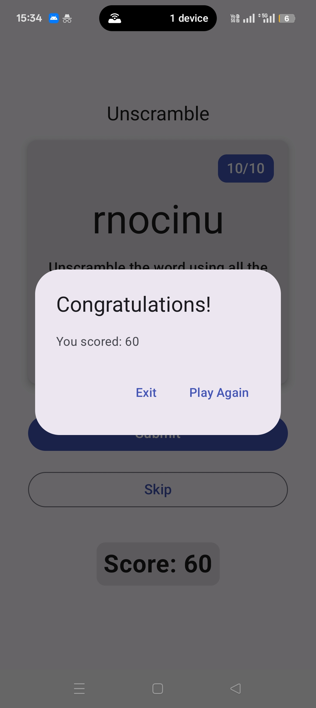
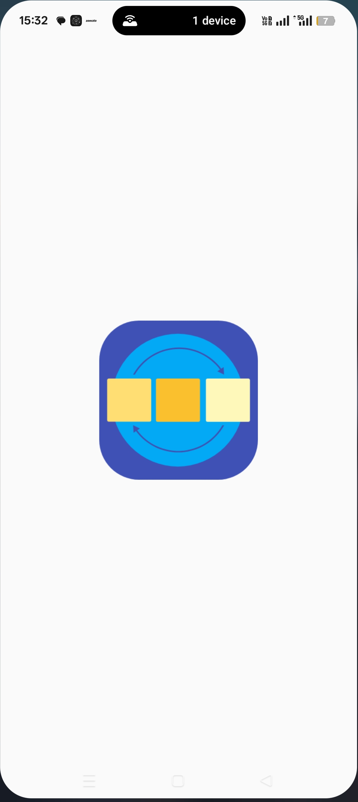
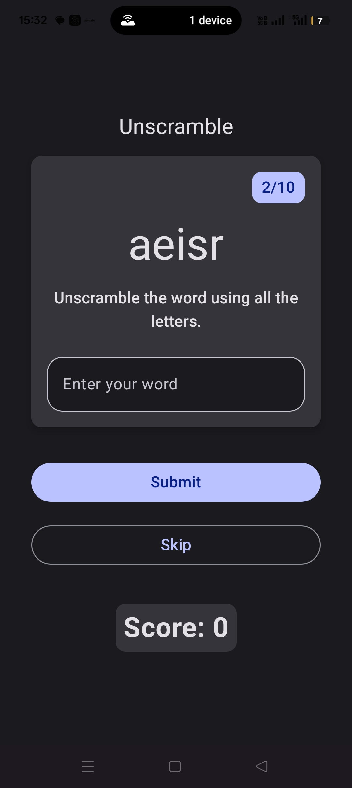
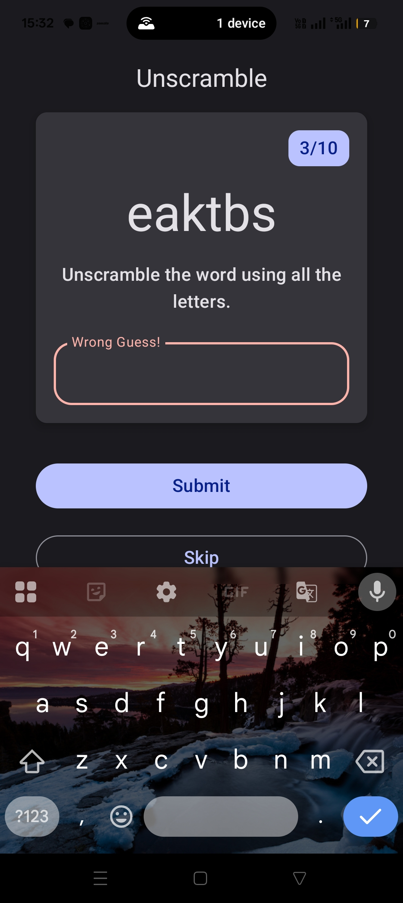
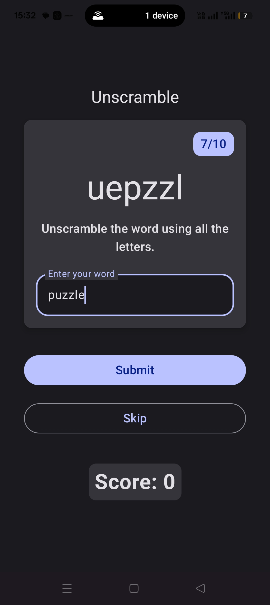
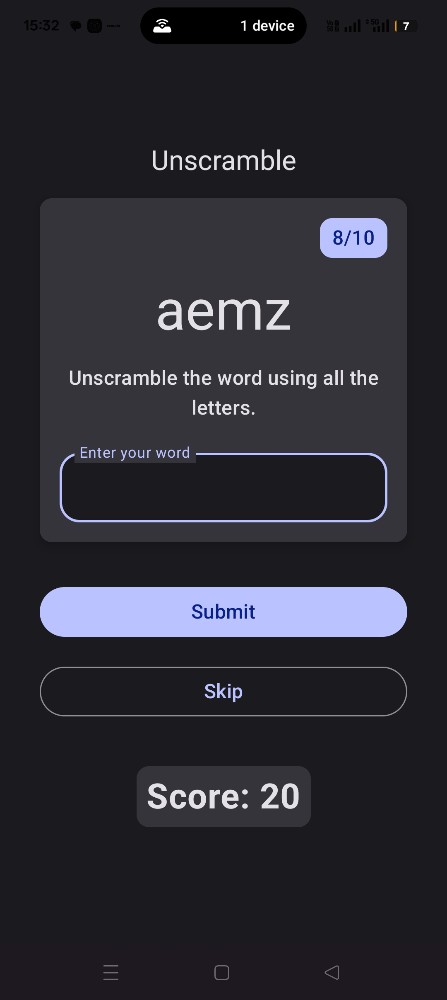
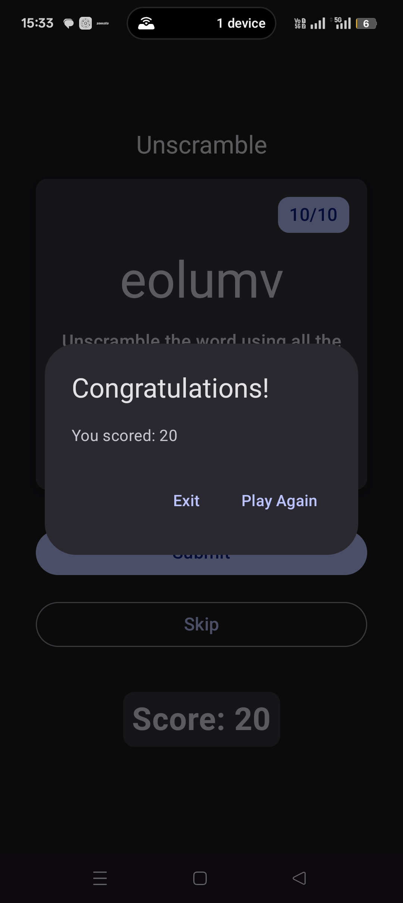

# 🔠 Unscramble Word Game


## 📖 Overview
A fun and interactive **single-player word unscrambler game** built with **Kotlin** and **Jetpack Compose**.  
The player is presented with a scrambled word and must rearrange the letters to form the correct word.  
The app includes scoring, word skipping, and a total of **10 rounds per game**, following modern Android architecture best practices.

---

## 🚀 Features

- 🎮 **Engaging Gameplay** – Unscramble words using all given letters.
- 🏆 **Scoring System** – Earn points for correct answers.
- 🔄 **Word Skipping** – Option to skip words without penalty.
- 📊 **Word Count Tracker** – Displays current round (1/10 to 10/10).
- 🎨 **Material Design UI** – Built with Jetpack Compose and theming.
- 📱 **Dialog Support** – Displays game results (score + replay option).
- 🧩 **State Management** – Uses `remember` and `mutableState` APIs.
- 🏗 **MVVM Architecture** – Clean separation of UI, data, and logic.
- ✅ **Best Practices** – Follows modern Android development principles.

---

## 🛠️ Tech Stack

- **Language**: Kotlin
- **UI Framework**: Jetpack Compose
- **Architecture**: MVVM (Model-View-ViewModel)
- **Data Flow**: Unidirectional, state-driven UI updates
- **Design**: Material Design 3, Theming, Dialogs
- **IDE**: Android Studio

---

## 📸 Screenshots

Below are some screenshots of the app in action:

|-------------|------------|------------|------------|------------|
|  |  |  |  |  |

|------------|------------|------------|------------|-------------|
|  |  |  |  |  |


---

## 📂 Project Structure

app/
├── data/ # Data models & word list
├── ui/ # UI components (Jetpack Compose)
│ ├── game/ # Game screen composables
│ ├── theme/ # Material theme & colors
├── viewmodel/ # GameViewModel (state management, logic)
└── MainActivity # Entry point

---

## 🎯 How to Run

1. Clone this repository:
   ```bash
   git clone https://github.com/paulIndit25/Unscrambled-Word-Game-App.git
   
2. Open in Android Studio.

3. Build & run on an emulator or physical device.
